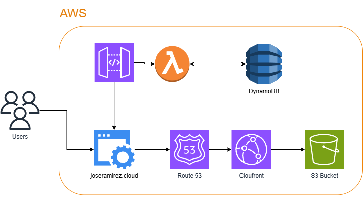

# AWS Cloud Resume Challenge
This is my submission for the AWS Cloud Resume Challenge. The challenge is to create a cloud-hosted resume website that is highly available, scalable, and cost-effective. The website should be able to withstand a surge in traffic and should be able to handle requests from different regions.

## Architecture
The architecture of the website is as follows:
1. The website is hosted on an S3 bucket.
2. The S3 bucket is fronted by a CloudFront distribution.
3. Route 53 is used for DNS routing.
4. API Gateway is used to create a REST API that triggers a Lambda function.
5. The Lambda function reads data from a DynamoDB table and returns the data to the user.

**Services Used:**
- S3
- CloudFront
- Route 53
- API Gateway
- Lambda
- DynamoDB
- Certificate Manager